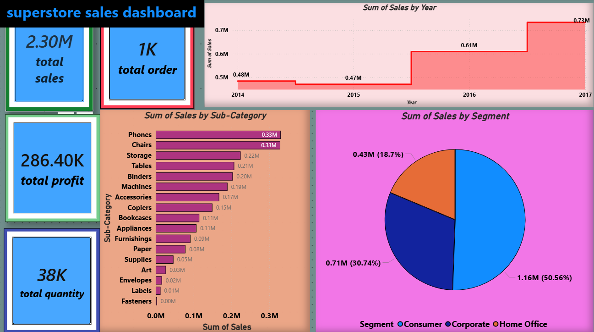

# powerbi-superstore-sales-dashboard
power bi dashboard analyzing superstore sales data with KPIs,sales trends,and segment analysis
 Superstore Sales Dashboard (Power BI)

## Project Overview
This Power BI dashboard analyzes Superstore sales data to provide insights into sales performance, profit trends, and customer segments.

## Key Metrics
- Total Sales: 2.30M
- Total Profit: 286K
- Total Orders: 1K
- Total Quantity: 38K

## Dashboard Features
* KPI Cards for Sales, Profit, Orders, Quantity  
* Sales by Sub-Category Analysis  
* Sales Trend by Year  
* Segment-wise Sales Distribution  

## Tools Used
- Power BI
- Excel
- Data Visualization

## Insights
- Consumer segment contributes the highest sales
- Phones and Chairs are top-selling categories
- Sales increased significantly after 2016

## Dashboard Preview

